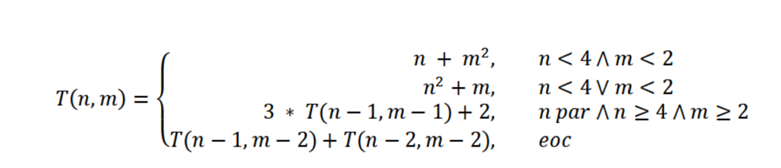

# 🚀 Portafolio de Ingeniería de Software

¡Hola! 👋 Soy **Pablo**, estudiante de Ingeniería de Software.
Este repositorio documenta mi progreso y aprendizaje en algoritmos, estructuras de datos y desarrollo de software.

## 🛠️ Tecnologías
* **Lenguajes:** Java ☕, Python 🐍
* **Herramientas:** Git, Eclipse, GitHub
* **Enfoque:** Algoritmia, Optimización y Clean Code

---

## 📂 Proyecto Destacado: Optimización de Recursividad
**Ubicación:** `/Practica_recursion/EjercicioT.java`

### 📝 Descripción del Problema
El objetivo es implementar y optimizar una función matemática $T(n, m)$ definida por partes, que presenta casos base condicionales y ramas de doble recursividad.

**Definición Matemática:**


### 💡 Solución Implementada (Java)
Para resolver este problema, he implementado una solución utilizando **Memoization** (Programación Dinámica Top-Down) para evitar el recálculo de subproblemas.

* **Estructura de Datos:** Uso un `HashMap<InPair, Integer>` como caché.
* **Clave Compuesta:** He utilizado un `record InPair` para manejar las coordenadas $(n, m)$ de forma eficiente en el mapa.

### 📊 Análisis de Complejidad

| Estrategia | Tiempo ⏱️ | Espacio 🧠 | Notas Técnicas |
| :--- | :--- | :--- | :--- |
| **Recursiva Simple** | $O(2^n)$ (Exponencial) | $O(n)$ (Stack) | Inviable para $n, m > 30$. Recalcula las mismas ramas múltiples veces. |
| **Con Memoization (Map)** | $O(n \cdot m)$ (Lineal) | $O(n \cdot m)$ (Heap) | **Solución elegida.** Drástica reducción de tiempo. Usa un `HashMap` para guardar resultados previos. |
| **Iterativa (Tabulación)** | $O(n \cdot m)$ | $O(n \cdot m)$ | Elimina el riesgo de *StackOverflow* rellenando una matriz desde abajo (Bottom-Up). |

---

## 🚀 Cómo ejecutar el código
1.  Clona el repositorio:
    ```bash
    git clone [https://github.com/pablowingu/MIS-PR-CTICAS.git](https://github.com/pablowingu/MIS-PR-CTICAS.git)
    ```
2.  Importa el proyecto en **Eclipse** o **IntelliJ**.
3.  Navega a la carpeta `Tema-Recursividad`.
4.  Ejecuta el archivo `EjercicioT.java` como *Java Application*.

---
*Repositorio mantenido por Pablo Bermejo.*